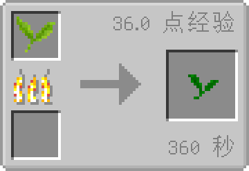

# 抹茶青叶

蒸汽杀青后的产物，可用于制作抹茶粉。

### 获取方式

|   材料   	|                 合成方式                	|     备注     	|
|:--------:	|:---------------------------------------:	|:------------:	|
| [绿茶鲜叶](./tea_leaf.md)*1 	|      	| **熔炉** 使用 
6min / 36xp 	|