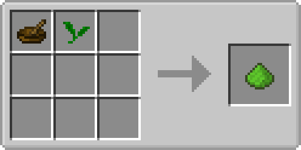

# 抹茶粉

使用研钵研磨抹茶青叶后获得。可以泡制抹茶或制作抹茶饼干

### 获取方式

|   材料   	|                 合成方式                	|     备注     	|
|:--------:	|:---------------------------------------:	|:------------:	|
| 木质钵体\*1
抹茶青叶\*1 	|      	| 工作台使用 	|