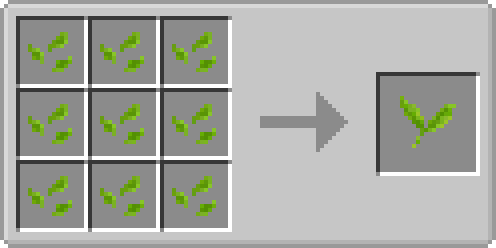
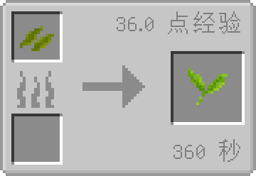

# 绿茶鲜叶

绿茶鲜叶，是茶的开始。

### 获取方式

|   材料   	|                 合成方式                	|     备注     	|
|:--------:	|:---------------------------------------:	|:------------:	|
| [碎茶叶](./broken_tea.md)*9 	|      	| 工作台合成获得 	|

|   材料   	|                 合成方式                	|     备注     	|
|:--------:	|:---------------------------------------:	|:------------:	|
| [湿茶叶](./wet_tea.md)*1 	|      	| **熔炉** 使用
可用**熔炉**将湿茶叶重新变为绿茶鲜叶
6min / 36xp 	|