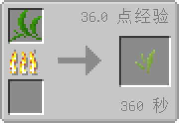

# 六种干叶

## 绿茶干叶

干燥的绿茶叶，可用于泡制绿茶。

### 获取方式

|   材料   	|                 合成方式                	|     备注     	|
|:--------:	|:---------------------------------------:	|:------------:	|
| [绿茶鲜叶](./tea_leaf.md)*1 	|   无   	| **发酵桶** 使用
绿茶鲜叶的基础上发酵 
5min / 15xp 	|

## 白茶干叶

属于全发酵茶，可以泡制红茶。

### 获取方式

|   材料   	|                 合成方式                	|     备注     	|
|:--------:	|:---------------------------------------:	|:------------:	|
| [绿茶青叶](./half_dried_tea.md)*1 	|     	| **烟熏炉** 使用
绿茶青叶的基础进行烟熏 
6min 36xp 	|

## 红茶干叶

属于全发酵茶，可以泡制红茶。

### 获取方式

|   材料   	|                 合成方式                	|     备注     	|
|:--------:	|:---------------------------------------:	|:------------:	|
| [绿茶青叶](./half_dried_tea.md)*1 	|   无   	| **发酵桶** 使用
绿茶青叶的基础进行发酵
5min / 15xp 	|

## 青茶干叶

属于全发酵茶，可以泡制红茶。

### 获取方式

|   材料   	|                 合成方式                	|     备注     	|
|:--------:	|:---------------------------------------:	|:------------:	|
| [绿茶青叶](./half_dried_tea.md)*1 	|   无  	| **茶簸箕** 使用
绿茶青叶的基础进行茶簸箕
2min / 12xp 	|

## 黄茶干叶

可以泡制黄茶。

### 获取方式

|   材料   	|                 合成方式                	|     备注     	|
|:--------:	|:---------------------------------------:	|:------------:	|
| [绿茶干叶](./teastory_leaf#绿茶干叶)*1 	|    无  	| **发酵桶** 使用
绿茶干叶的基础进行发酵
5min / 15xp 	|

## 黑茶干叶

可以泡制黑茶。

### 获取方式

|   材料   	|                 合成方式                	|     备注     	|
|:--------:	|:---------------------------------------:	|:------------:	|
| [红茶干叶](./teastory_leaf#红茶干叶)*1 	|   无   	| **发酵桶** 使用
红茶干叶的基础进行发酵
5min / 15xp 	|