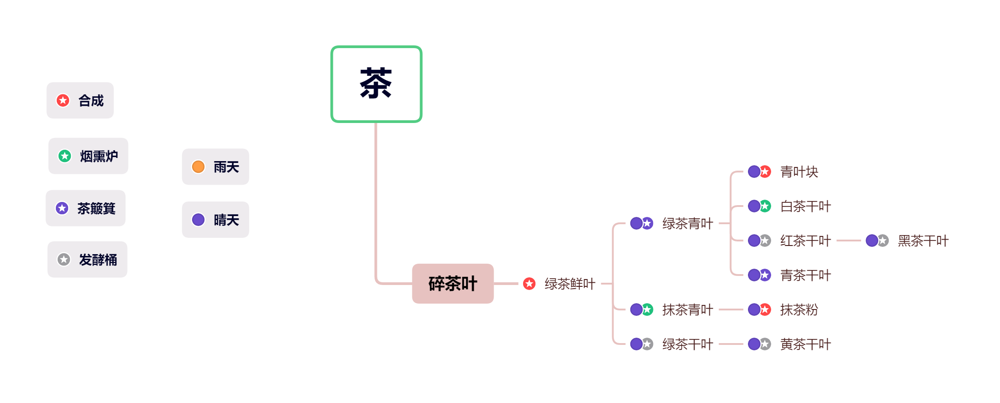

# 介绍

基于 ** [茶风·纪事Tea the Story](https://www.mcmod.cn/class/557.html) ** 进行二次创作开发。

> 当你踏入「茶香世界」，你将被带入一个充满诗意和奇妙的虚拟现实。这个将茶文化融入了我的世界，为你创造了一个全新的冒险体验。在这个神秘的世界里，你将探索茶园、品尝不同种类的茶叶，与茶农互动，学习制作茶饮的艺术，甚至可以通过茶道来解开隐藏的谜题。
>
>「茶香世界」不仅仅是一次冒险，更是一次文化交流。你将遇到来自不同国家和时代的NPC，通过交流与合作，了解茶文化在世界各地的演变和影响。你可以在茶庄举办茶会，邀请其他玩家一起分享茶叶的美味，也可以在茶艺学校学习茶道的精髓，成为一名真正的茶艺大师。
>
> 但是，「茶香世界」并非只有平静的时光。你还将面对茶园中的自然灾害和怪物威胁，需要运用你的智慧和勇气来保护茶文化的传承。通过探索神秘的茶山、解锁古老的茶叶秘方，你将逐渐揭开这个世界的历史和秘密。
>
> 在「茶香世界」中，你将体验到茶文化的深厚内涵，感受到与自然和谐共存的美好。准备好在这个充满茶香的冒险中展开全新的旅程了吗？让我们一起探索茶的魅力，畅游在茶香四溢的奇幻世界中！

## 制作工艺

|       材料      |               合成方式              |       材料      |                合成方式                |
|:---------------:|:-----------------------------------:|:---------------:|:--------------------------------------:|
|     绿茶鲜叶    |                 合成                |     白茶干叶    |      绿茶青叶的基础进行烟熏 / 晴天     |
|     绿茶青叶    |      绿茶鲜叶的基础茶簸箕 / 不限    |     红茶干叶    |     绿茶青叶的基础进行发酵   / 晴天    |
|     抹茶青叶    |          绿茶鲜叶烟熏 / 晴天        |     青茶干叶    |     绿茶青叶的基础进行茶簸箕 / 晴天    |
|      湿茶叶     |     在雨天制作绿茶青叶有概率获得    |     黄茶干叶    |      绿茶干叶的基础进行发酵 / 晴天     |
|     绿茶干叶    |       绿茶鲜叶的基础发酵/ 晴天      |     黑茶干叶    |      红茶干叶的基础进行发酵 / 晴天     |

## 物品

### 基本茶叶 - 九种

- [碎茶叶](./items/broken_tea)
- [绿茶鲜叶](./items/tea_leaf)
- [绿茶青叶](./items/half_dried_tea)
- [抹茶青叶](./items/matcha_leaf)
- [湿茶叶](./items/wet_tea)
- [干叶集合(绿茶、白茶、红茶、青茶、黄茶、黑茶干叶)](./items/teastory_leaf)
- [茶渣集合(绿茶、白茶、红茶、青茶、黄茶、黑茶茶渣)](./items/tea_residue)
- [茶包集合(绿茶、白茶、红茶、青茶、黄茶、黑茶茶包)](./items/tea_bag)

### 器具

- [石具(石茶杯、石罐)](./items/stone)

### 粉类

- [抹茶粉](./items/matcha_powder)