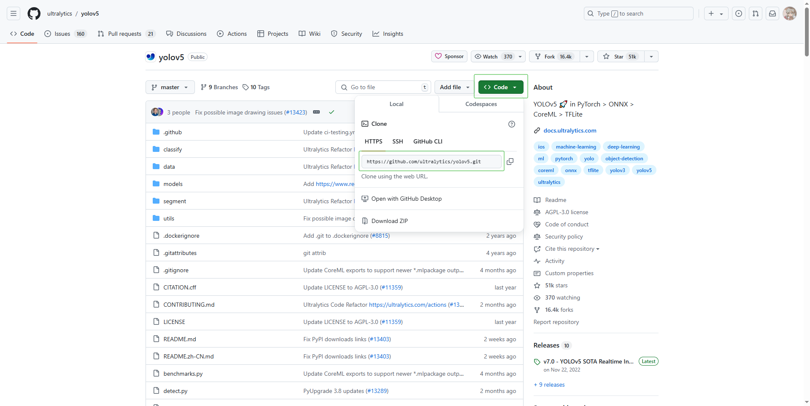
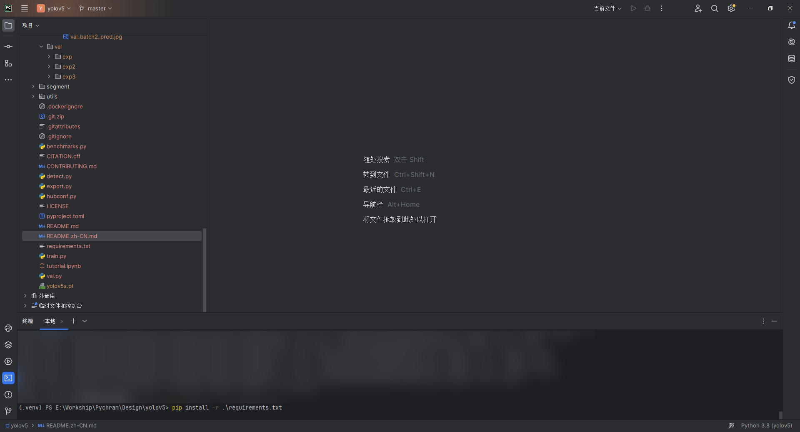
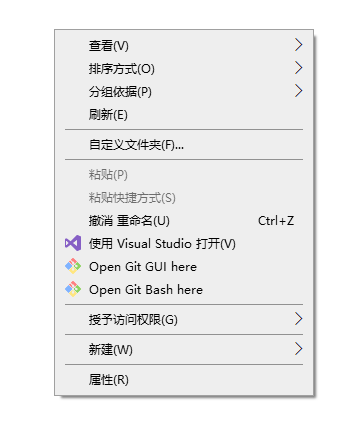

# YOLOv5 学习

:::tip
文内出现的 **< >** 属于必填内容 **[ ]** 属于可选内容
:::

## 环境搭建

一共为两个分支，一支为纯CPU训练（推理和训练速度受限），另外一支为基于GPU（速度较快）

> CPU：Pycharm，PyTorch（torch，torchvision），Git（可选）
>
> GPU：Pycharm，PyTorch（torch + <font color="#D95350">**cux**</font>，torchvision + <font color="#D95350">**cux**</font>），Git（可选），<font color="#D95350">**CUDA**</font>

很明显的区域，CPU与GPU分支的明显区别就在于有无CUDA，因此我们接下来先进行CPU环境的搭建

### CPU

#### 1. Pycharm

官方安装地址 *https://www.jetbrains.com/pycharm/download/?section=windows*

2023.3.4 学习版安装教程 *https://www.quanxiaoha.com/pycharm-pojie/pycharm-pojie-202334.html*

接下来是选择版本管理 Git **（可选）**

#### *2. Git*

首先，git 用于版本管理，可以便捷的对工作进行各版本的管理（开发版本，测试版本等），并且在配合Github的条件下便于多人协作项目操作的管理 *https://git-scm.com/*

简单的操作命令可以学习一下这篇教程 *https://www.runoob.com/git/git-install-setup.html*

> 一般常用的命令之一（其他自行了解）大概是 git clone <仓库地址>（地址分两种，一种是https，另一种是git地址），这个命令的作用是什么呢？
>
> 举个例子，你需要在别人项目的基础上进行工作的时候，需要用到别人的项目，这个时候最简单的办法就是直接 download，这一种方法仅仅包含项目文件，但不包含管理文件（仓库），而 git clone 则是在下载的同时也将对方作者的仓库也一并下载了下来，这样就便于你后期的 push、pull 和 commit 操作（具体命令含义参考上文菜鸟教程）
>
> *我的 MC 项目 [Cluster - github](https://github.com/clustergap)*

那么我们结合该项目，于是先找到 yolov5 在 github 上的仓库地址 看图！

 [git yolov5 图片](../image/other/git_yolov5.png)

然后在本地创建一个文件夹，例如 StuYolov5，然后右键打开 Git base here，打开一个终端，或者 Shell/cmd 均可，但是需要 cd 到本目录下，到此工程文件已经下载到你的PC上了

会得到 yolov5-master 字样的文件夹，然后可以打开 Pycharm 把该文件夹作为项目打开，如果接下来没有 CUDA 的需求，打开编译器之后，会提示选择解释器，根据 yolov5 官方给出的要求，需要选择的 python 版本须大于等于 3.8.0，然后选择结束，大概率会提示是否安装前置（requirements的同义），如果提示就安装，如果没有那么需要手动进行安装，在 pycharm 里面打开一个终端，输入下面的命令，然后等待下载前置

```
pip install -r .\requirements.txt
```

 [pycharm_rq](../image/other/pycharm_rq.png)

> 克隆 repo，并要求在 [**Python>=3.8.0**](https://www.python.org/) 环境中安装 [requirements.txt](https://github.com/ultralytics/yolov5/blob/master/requirements.txt) ，且要求 [**PyTorch>=1.8**](https://pytorch.org/get-started/locally/) 。

<!--  [git yolov5 图片](../image/other/right_click.png) -->

接下来便是最重要的部分 pytorch 下载

#### 3. Pytorch

在下载 Pytorch 的时候可能需要魔法上网，这样速度会较快，当然也可以选择国内一些高效的 [镜像源](https://blog.csdn.net/sjjsaaaa/article/details/110096059)

**如果你是Pycharm用户，那么下面可以了解一下，避免 pychram 自动安装前置的时候出现问题。**

首先，打开 Pytorch 的官网 *https://pytorch.org/*

然后会看见 Install PyTorch 字样，由于是 CPU 平台，因此在平台那一栏选择 CPU，然后Package（包管理软件）选择 pip，然后 OS 自行选择，Pytorch 构建版本选择稳定版本（stable）即可，如果有需求之前版本的选择下面的 previous versions，具体教程自行了解，或者私信邮箱 *ersynn@outlook.com*

然后复制他提供的命令，在 pycharm 终端内输入，即可下载对应的 pytorch 组件

到此已经完成了所有的基础步骤，恭喜你已经进入了Yolo世界！

下面检验自己的成果，在 pycharm 终端内输入 python ./detect.py，然后出现 Results saved to runs\detect\exp 字样则表示你已经初步成功了！