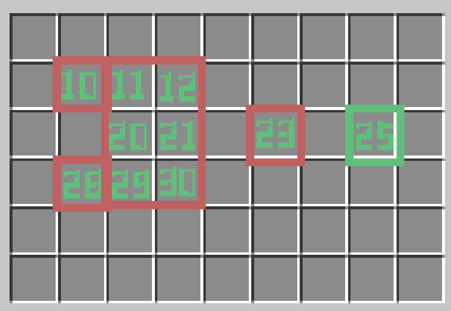

<head>
    <meta itemProp="image" content="https://mscraft.cn/img/share_logo.png" />
    <meta itemProp="description" content="DiyInventoryCrafting 使用文档" />

</head>

# DiyInventoryCrafting

### 命令

|         命令        |    用法    |
|:-------------------:|:----------:|
|   /diycraft relaod  |    重载    |
|    /diycraft list   | 查看文件数 |
|  /diycraft new name | 创建新文件 |
| /diycraft open name |  打开文件  |

### 使用

* 使用 **工作台** 合成方式定义配方.

* 创建一个新的自定义文件（guis）.

* 确定 **guis name** 参数和配方槽位. 你可以阅读下图来获得一些灵感.

* 配方槽位并不一定需要按照顺序, 你能够改变槽位并且如上图可以允许有分块但是必须保证这个槽位能够 **组成 3*3 的合成方式**。
